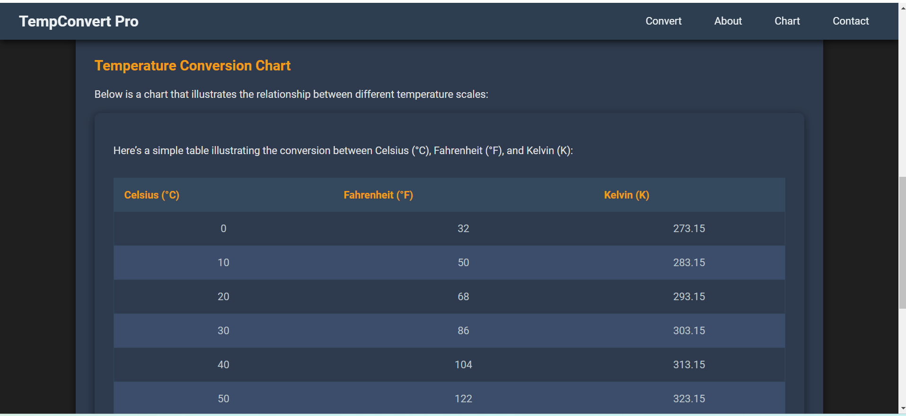
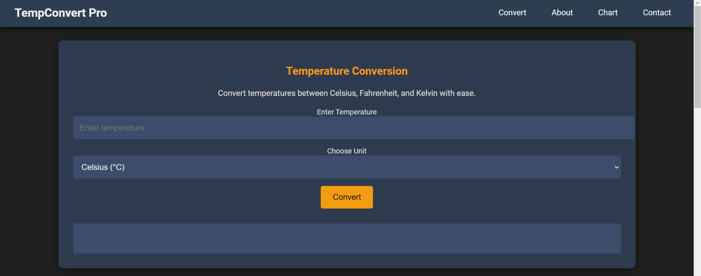

# PRODIGY_SD_1-Temperature-Conversion-App-
A Flask-based web app for temperature conversion between Celsius, Fahrenheit, and Kelvin.

# Temperature Conversion App 🌡️

A professional web app built with Flask and JavaScript that converts temperatures between Celsius, Fahrenheit, and Kelvin units.

## 🚀 Features

- **User-Friendly Interface**: Simple form to input a temperature value and select the unit.
- **Accurate Conversions**: Converts temperatures between Celsius, Fahrenheit, and Kelvin with precise calculations.
- **Responsive Design**: Optimized for mobile and desktop devices using modern HTML5 and CSS3.
- **AJAX-Powered**: Sends data asynchronously to the backend using JavaScript (fetch API).

## 🛠️ Technology Stack

- **Backend**: Flask (Python)
- **Frontend**: HTML5, CSS3, JavaScript (AJAX)
- **Design**: Responsive, modern layout with clean UI elements
- **Version Control**: Git & GitHub

## 🌍 Live Demo

Check out the [Live Demo] 

https://github.com/user-attachments/assets/9cb864d0-72ef-4410-b1b2-c60b9e654e67


## 🖥️ Local Development Setup

Follow these instructions to run the project locally:

### Prerequisites

- Python 3.x
- Flask

### Installation

1. Clone the repository:

   ```bash
   git clone https://github.com/uttam1910/Temperature-Conversion-App.git

2. Navigate to the project directory:

   ```bash
   cd Temperature-Conversion-App
   
3. Install the required Python packages:

   ```bash
   pip install -r requirements.txt


### Run the Application

1. Run the Flask server:
   
   ```bash
   python app.py

2. Open your browser and navigate to:

   ```bash
   http://127.0.0.1:5000


### Usage

Input a temperature value.
Select the unit (Celsius, Fahrenheit, or Kelvin).
Click Convert to see the results.


## 📸 Screenshots

### Home Page
![Home Page]

### Temperature Converter
![Converter]

## 🤝 Contributing

Contributions are welcome! If you'd like to improve this project, feel free to fork the repository and submit a pull request.

---
